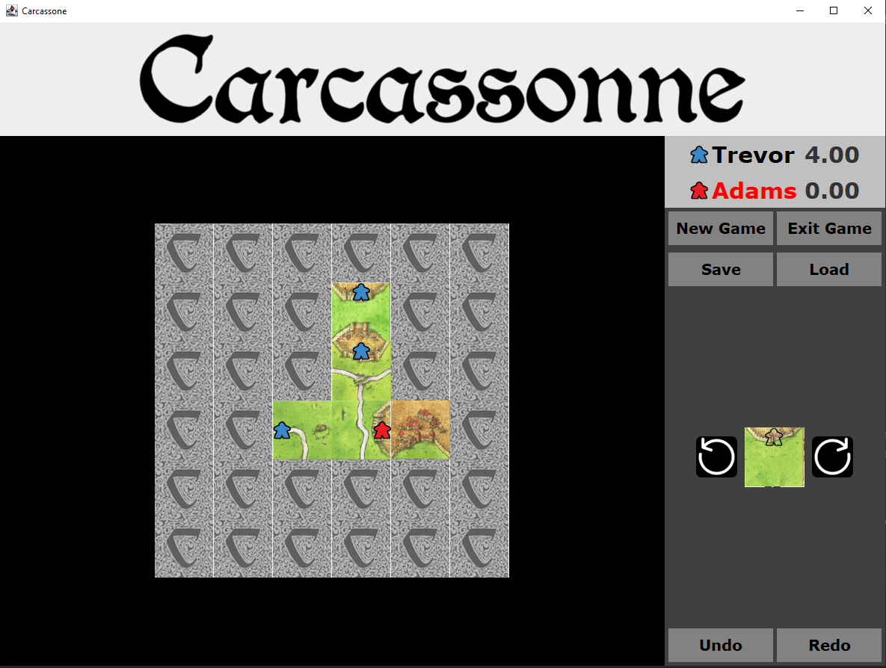

# Carcassonne

This game was developed by Lukas for the class Software Engeneering at HTWG Konstanz.

Screenshot of GUI

## Gameplay

In this implementation 1 to 4 players can play.
They each place one card each turn until no cards can be placed on the board anymore.
On every card they place they can put no or exactly one manican on one of the territories (e.g. castle or road) on the card.
Cards can only be put next to another card. For every castle or road closed, players get 2 or 1 points for each card, respectively. The player with the most points wins.

## Disclaimer
The rights to the game Carcassonne belong to Hans im Glück Verlags-GmbH. This project only uses parts of the gameplay logic and media without any commercial interest and is only for educational purposes.

## Guides for Reviewer

### Option Monade
e.g. gridComponent -> gridBaseImpl -> case class Matrix -> getDirEnv

### Pattern I
RawCardFactory -> Factory

### Pattern II
PrettyPrint -> Strategy

### Pattern III
CardManipulator -> Builder

### Sidenotes
GUI Testing not opimal

#
This is a project created from the htwg-scala-seed-master. It is a basic scala project as used in the
class Software Engineering at the University of Applied Science HTWG Konstanz.

Do not copy or clone this project, please use the htwg-scala-seed project for that. You can find it at 
https://github.com/markoboger/htwg-scala-seed.git
